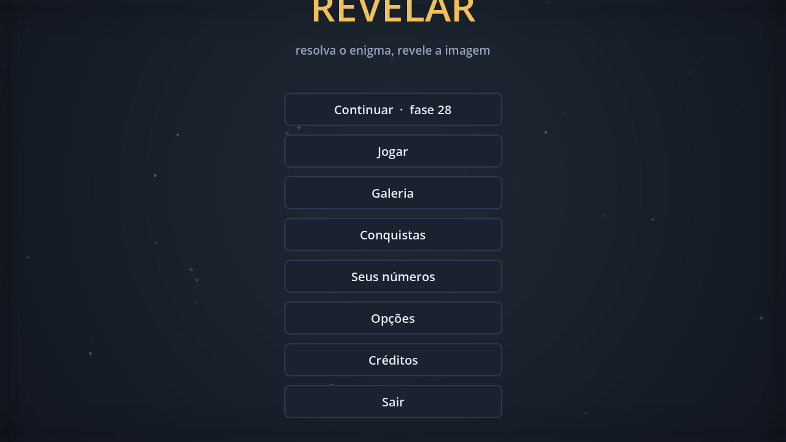

# Revelar — um jogo de picross

Jogo completo em Godot 4.6. Você resolve o quebra-cabeça de lógica e a imagem
escondida se revela colorida, entrando na sua galeria.



## Abrir

```bash
godot                 # abre o editor / joga
./testar.sh           # roda a suíte inteira, sem janela
```

## O que tem dentro

- **50 fases** em 4 capítulos: 10 de 5×5, 15 de 10×10, 15 de 15×15 e 10 de 20×20
- **12 telas e estados**: abertura, menu, capítulos, seleção de fases, jogo,
  pausa, derrota, revelação, galeria, imagem ampliada, opções e créditos
- **Progresso salvo** em `user://progresso.save`, com estrelas e melhor tempo
- **Áudio sintetizado por código** — nenhum arquivo de som no repositório
- **Resposta em tudo**: botões que reagem ao toque, células que estalam ao
  serem pintadas, faíscas quando uma linha fecha, confete na revelação e um
  fundo com brilho e poeira em movimento

## A regra que sustenta o jogo

Todo puzzle tem **solução única alcançável por lógica pura**. Isso não é
promessa: um solucionador em Python resolve cada desenho usando só dedução,
e um desenho que ele não resolve não entra no jogo.

A mesma medição define a ordem das fases e o tempo-alvo das 3 estrelas — o
balanceamento é medido, não estimado. O relatório está em [AUDITORIA.md](AUDITORIA.md).

Sete desenhos foram corrigidos durante a produção porque o solucionador
apontou ambiguidade. O padrão era sempre o mesmo: duas células em diagonal
com as mesmas pistas, que aceitam duas leituras.

## Como jogar

| Ação | Comando |
|---|---|
| Pintar | botão esquerdo (arraste preenche em linha reta) |
| Marcar vazia | botão direito |
| Desfazer | `Z` |
| Dica | `H` — revela uma célula, abre mão das 3 estrelas |
| Pausa | `Esc` |

Errar custa uma vida; três erros encerram a partida. Quem preferir sem
pressão liga o **modo relaxado** nas opções.

## Estrutura

```
ferramentas/       Python: autoria e validação dos puzzles (não entra no jogo)
dados/             puzzles.json — o conteúdo final, gerado e validado
scripts/nucleo/    regra do jogo, sem interface: Puzzle e Partida
scripts/autoload/  Catalogo, Progresso, Audio, Navegacao
scripts/ui/        Estilo, GradeJogo, ImagemPuzzle
scripts/telas/     uma classe por tela
testes/            suíte headless
```

O núcleo não conhece nós nem desenho, e por isso a suíte consegue jogar as 50
fases inteiras sem abrir janela.

## Testes

```
── auditoria dos puzzles ──
SOLUCIONADOR OK              12 testes
50 desenhos, 0 com problema
── núcleo do jogo ──
NÚCLEO OK — 46/46 testes
── fluxo das telas ──
FLUXO OK — 24/24 verificações
```

## Gravar o jogo em vídeo

O jogo sabe se jogar sozinho, do início à revelação, e o Godot grava isso:

```bash
xvfb-run -a godot --resolution 1280x720 \
  --write-movie demo.avi --fixed-fps 30 -- --demonstracao
ffmpeg -i demo.avi -c:v libx264 -crf 24 -pix_fmt yuv420p demonstracao.mp4
```

O resultado está em `capturas/demonstracao.mp4`. Com `--fixed-fps` o tempo do
jogo não depende da velocidade da gravação, então o vídeo sai no ritmo certo
mesmo levando mais tempo para ser escrito.

## Ver as telas sem monitor

```bash
CAPTURA_DESTINO=/tmp/menu.png xvfb-run -a godot --resolution 1280x720 -- --capturar menu --demo
```

As capturas de todas as telas estão em `capturas/`, e a folha com os 50
desenhos em `capturas/folha_de_arte.png` — gerada por
`python3 ferramentas/folha_contato.py`, que é como a arte é auditada de uma vez.

## Acrescentar uma fase

1. Desenhe em `ferramentas/arte.py` com `#` e `.`
2. `python3 ferramentas/validar_bloco.py` — reprova se exigir chute
3. `python3 ferramentas/construir.py` — regera os dados e o relatório

A fase entra no capítulo do seu tamanho, na posição que a dificuldade medida
mandar.
